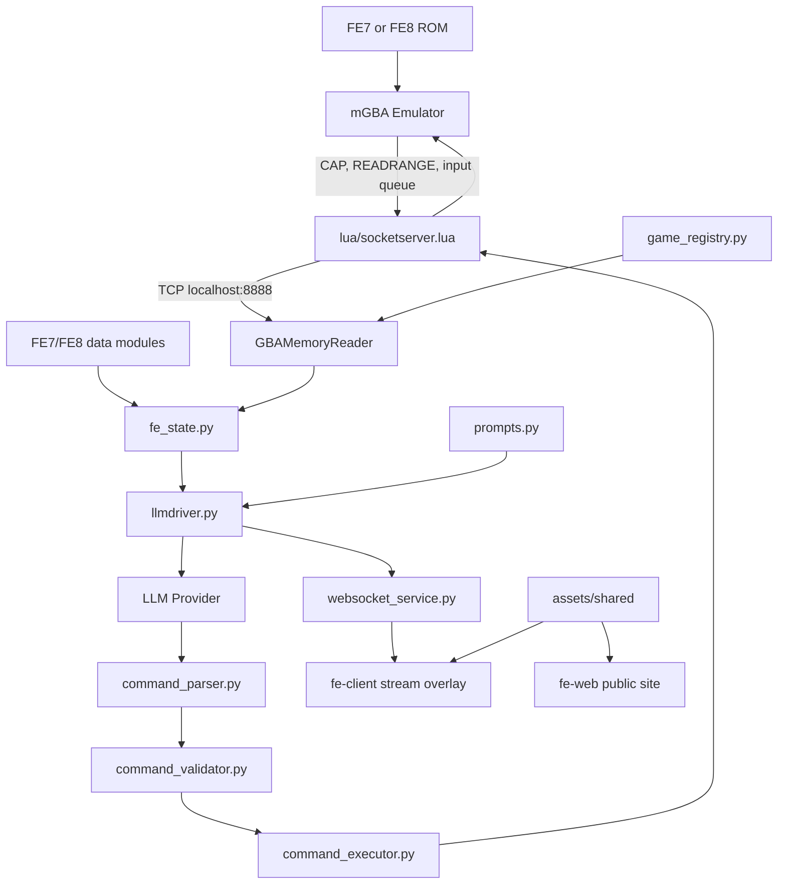

# Architecture

This repository is a GBA Fire Emblem agent harness. It connects mGBA, FE7/FE8
memory maps, a Python LLM loop, deterministic command execution, and React
frontends.

## System Flow



## Runtime Components

| Layer | Files | Purpose |
| --- | --- | --- |
| Emulator bridge | `lua/socketserver.lua`, `lua/fe7_memory.lua`, `lua/fe8_memory.lua` | Screenshot capture, button input, savestate control, ROM detection, and direct memory reads. |
| Game registry | `src/data/game_registry.py` | Maps ROM codes (`AE7E`, `BE8E`) to FE7/FE8 addresses and game metadata. |
| Memory reader | `src/utils/memory_reader.py` | Reads phase, turn, cursor, unit arrays, terrain, UI state, and FE-specific fields. |
| State shaping | `src/game/fe_state.py` | Converts memory into the JSON context consumed by the LLM and frontend. |
| LLM runtime | `src/core/llmdriver.py`, `src/llm/*` | Captures screenshots, builds prompts, manages memory/context, calls providers, and records results. |
| Command system | `src/game/command_parser.py`, `command_validator.py`, `command_executor.py` | Turns semantic `COMMAND:` output into safe deterministic GBA button sequences. |
| Telemetry | `src/services/websocket_service.py` | Streams state, model thoughts, actions, and chronicle entries to the overlay. |
| Frontends | `fe-client/`, `fe-web/` | Stream overlay/dashboard and public project site. |

## Game Detection

The harness supports FE7 and FE8 through the same reader interface.

- `FE_GAME=fe7` or `FE_GAME=fe8` can pin the expected game.
- `ROM_FILE` selects the ROM filename in `roms/`.
- The Lua/Python bridge reads the ROM header code at runtime and selects the
  matching registry entry when possible.

## Data Flow

1. `src/core/run.py` launches mGBA with the Lua socket script and opens a socket.
2. `GBAMemoryReader` reads memory in batches to avoid hundreds of tiny socket
   calls per cycle.
3. `prep_fe_llm()` enriches raw memory with chapter objectives, lookup names,
   terrain, unit status, and command-relevant flags.
4. `llmdriver.py` sends a compact context payload plus screenshots to the
   selected model.
5. The model returns a semantic command, such as `COMMAND: SELECT unit="Lyn"` or
   `COMMAND: MOVE to=[8,7]`.
6. The command system validates the action against current memory state and
   emits controller inputs.
7. The WebSocket service broadcasts the latest state and action log to
   `fe-client`.

## Public Frontend Roles

- `fe-client` is the live stream overlay/dashboard. It connects to the runtime
  WebSocket and is the primary operational UI.
- `fe-web` is a public-facing project site for explanation, docs, benchmarks,
  and FE8-specific asset downloads.
- `assets/shared` is the canonical asset source. Public frontend copies should
  be treated as distributable copies, not the source of truth.

## Verification

Use focused tests first, then frontend checks:

```bash
python -m pytest
cd fe-client && npm run lint && npm run build
cd ../fe-web && npm run lint && npm run build
```

For address changes, verify against a live ROM with `tools/memory_probe.py` and
document the game code, chapter, and observed address behavior.
