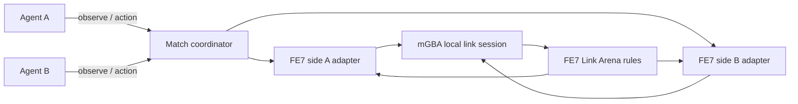

# FE7 Link Arena mode

## Goal

Give two agents a repeatable, head-to-head Fire Emblem 7 Link Arena match. A
match starts from a prepared roster, uses the game’s own link battle rules, and
does not require either agent to play the campaign. Each agent gets its own
emulated GBA screen and submits bounded actions to that side only.

The existing campaign loop stays separate. It assumes chapters, objectives,
player/enemy phases, and tutorial state; Link Arena needs its own setup flow,
observation contract, and match lifecycle.

## Save candidate

The selected candidate is the North American Pro Action Replay save by
Saint_Cyan dated 2004-05-05. GameFAQs describes it as having maxed stats,
Link Arena teams, weapons, and supports. The public GameFAQs save archive
snapshot contains the matching entry as `4120.xps`.

The candidate is downloaded locally as
[`roms/fe7-link-arena-maxed.xps`](../roms/fe7-link-arena-maxed.xps). It is a
64 KB-class X-Port snapshot/container, not a raw mGBA `.sav`. mGBA imported it
into an isolated FE7 copy and wrote a 32 KB `FE7.sav`. On Zephyrus, that save
booted, opened Extras and Link Arena, and loaded the `RAGNAROK` teams on both
clients. The roster is highly trained, but the live unit stats are not all at
their class caps, so “maxed” here describes the save listing rather than a
verified all-stats-capped roster. The converted file stays in the ignored
scratch path `roms/fe7-link-arena-maxed-unverified.sav` and the isolated runner
copy `%LOCALAPPDATA%\FE7-Link-Arena\runner\roms\fe7.sav`. Do not import over
`roms/fe7.sav` or commit ROM/save data.

The downloaded XPS has SHA-256
`98a54c038d7d65f0e06f75f23c82612a5acebf2cdac1be07865e6d57248e5bea`.

## Zephyrus workspace

The Windows launcher uses mGBA's installed path and stores match data under
`%LOCALAPPDATA%\FE7-Link-Arena`. To stage an isolated working copy on
Zephyrus from the Mac checkout, run:

```bash
scripts/mac/deploy-link-arena-zephyrus.sh
```

That copies the FE7 ROM into
`%LOCALAPPDATA%\FE7-Link-Arena\runner\roms` and stages the candidate XPS and
Link Arena runtime there. It stages the unverified 32 KB raw conversion as
`runner\roms\fe7.sav` only if the target does not already exist. It does not
open mGBA or touch the campaign save. Open
only the isolated `runner\roms\fe7.gba` in mGBA and confirm Continue/Extras
and the Link Arena roster in-game. If the raw save does not load, use mGBA's
**File → Save games → Convert save game…** with the staged XPS, writing to a
separate file before replacing the isolated `fe7.sav`. Start the runner after
the in-game check:

```powershell
& "$env:LOCALAPPDATA\FE7-Link-Arena\runner\scripts\windows\Start-Link-Arena.ps1" `
  -RepoRoot "$env:LOCALAPPDATA\FE7-Link-Arena\runner" `
  -Save "$env:LOCALAPPDATA\FE7-Link-Arena\runner\roms\fe7.sav"
```

This starts a separate two-ROM mGBA process. The existing `roms\fe7.sav` in
the campaign checkout is not used. The API and both control bridges bind to
loopback, and Windows inherits the current user's local-app-data ACLs for the
side-token files.

## Verified status

- The 2004 GameFAQs XPS save was imported into an isolated 32 KB battery save;
  both Zephyrus clients loaded the RAGNAROK Link Arena roster.
- Two mGBA cores connected through the Link Arena. Side A used port 18888,
  side B used 18889, and the token-scoped API served each client.
- `MinimaxAgent("A")` and `MinimaxAgent("B")` independently selected legal
  matchups and weapons from their side-scoped observations during a complete
  game. The game, rather than the policy model, resolved hit RNG, casualties,
  score, and the winner.
- The verified match ended on FE7's result screens: green 2P RAGNAROK placed
  1st with 520 points; blue 1P RAGNAROK placed 2nd with 346 points. Screenshots
  and the match ID are recorded in
  [`LINK_ARENA_MATCH_REPORT.md`](LINK_ARENA_MATCH_REPORT.md).
- Preserve the campaign save: the match used the isolated runner save and did
  not write to `roms/fe7.sav`.

The newer North American 32 KB GameShark save by Memory- (2026-05-19) is still
a possible alternate roster. It is described as 100% complete with three
optimized teams, not as an all-stats-capped roster.

## Runtime shape



- Start two copies of the same North American FE7 ROM in mGBA’s local
  multiplayer session, each with an independent save file and control bridge.
- Take both players through Link Arena setup and the connection handshake, then
  let the game own turn order, battle rules, RNG, and victory adjudication.
- Give each agent only its own screenshot and side-specific state. The
  coordinator routes each action to that side and rejects stale observations;
  reliable screen-settling detection is still to be built.
- Record the match seed/state checkpoint, both action streams, observations,
  and final result so the same matchup can be replayed and compared.

mGBA’s Qt frontend supports multiple game windows and local link cable play;
the installed app on Zephyrus is an mGBA 0.11 development build. Its Lua
startup script is attached to each loaded core. Windows allowed both scripts
to bind the same loopback port, so selecting a port by retrying on a bind error
did not distinguish the cores. The runner now claims one of two per-match
marker directories atomically before binding each core to its assigned port.
On 2026-09-27, this setup reached linked FE7 Link Arena combat and completed
the match recorded below. Cursor movement must be checked against the live
`DETAIL` cursor: batching repeated directional keys can overshoot a unit on
some FE7 screens.

## First implementation slice

The isolated runtime is in `src/link_arena/` with a launcher in
`tools/link_arena.py`. It copies the selected ROM and battery save into two
match-local directories, launches mGBA once with both ROMs and a generated
bridge script, then serves a loopback-only HTTP API. Each side gets its own
token file. Observations contain that side’s screenshot, parsed FE7 state and
units, and raw state strings. The coordinator writes each PNG under that
match's `side-a/observations` or `side-b/observations` directory and logs the
full observation state plus its image path to `events.jsonl`. The seed save
and ROM hashes are recorded in `session.json`. The API still does not parse the
Link Arena result screen into a terminal outcome; the verified winner was read
from FE7's result/ranking screens. The `settled` field is intentionally
unverified; `coherent` only indicates the exposed game-state string matched
before and after the capture.

Actions are side-token scoped, capped at eight button presses, serialized by
the coordinator, and tied to an observation ID. An action from the other side
invalidates old IDs; a changed game state also requires a fresh observation.
This first action contract is bounded button input. Menu and tactical
operations can replace it as Link Arena screens are decoded.

Once a converted `.sav` has been confirmed in-game, start a match with:

```bash
python3 tools/link_arena.py
```

The launcher prints the local API address and paths to the side token files.
Agents use `GET /v1/observe` and `GET /v1/status` with their own bearer token;
`POST /v1/action` accepts JSON of the form
`{"observation_id":"...","buttons":["RIGHT","A"]}`. It binds only to
`127.0.0.1`, as are the per-side control bridges; the coordinator writes
actions and observations to the match directory’s `events.jsonl` and saves
screenshots alongside them.

For example, use the side A token printed by the runner to observe and act:

```bash
TOKEN="$(cat /path/to/match/side-a.token)"
curl -H "Authorization: Bearer $TOKEN" http://127.0.0.1:18700/v1/observe
curl -X POST -H "Authorization: Bearer $TOKEN" -H "Content-Type: application/json" \
  -d '{"observation_id":"0-A-1","buttons":["RIGHT","A"]}' \
  http://127.0.0.1:18700/v1/action
```

## Agent contract

Use a standalone Link Arena state/action contract instead of campaign prompts.
The observation should include:

- side and setup/battle/result screen state;
- active phase, turn/round, cursor, and visible legal menu choices;
- both teams’ visible units, class, HP, stats, position, equipment, status, and
  acted/available state;
- screenshot plus raw-memory evidence and a coherence/settled marker.

Actions should be small, typed operations (menu choice, cursor move, unit
selection, movement, attack/weapon choice, wait/confirm) with bounded button
fallbacks for screens whose semantics are not yet decoded. Reject stale or
wrong-side commands. Do not let an agent write emulator memory or issue
unbounded button streams.

## Delivery plan

1. **Save and boot proof — complete.** The isolated XPS conversion opened the
   RAGNAROK roster in Link Arena.
2. **Cable and bridge proof — complete.** Two cores reached battle through
   side-specific loopback bridges and the local API.
3. **Playable minimax match — complete.** Two independent minimax policies
   chose matchups and weapons through the API; FE7 produced a 2P win.
4. **Next improvements.** Add cursor-aware tactical actions, menu/result
   screen decoding, automatic turn orchestration, and reset/replay from a
   checkpoint. The live run required supervised menu confirmation, and the
   early batched cursor path caused one off-policy A Oswin/B Bartre matchup
   before live cursor verification was added to the operator loop.

## First playable milestone

The first playable milestone is verified. This is a real FE7 Link Arena match,
not a campaign simulation or a scripted combat replay. The agent policies
produced matchup and weapon decisions; bounded controller inputs advanced
FE7's menus and its own battle/result logic. Fully automatic turn and result
screen orchestration remains future work.

## Sources

- [GameFAQs FE7 save listings](https://gamefaqs.gamespot.com/gba/468480-fire-emblem/saves)
- [Internet Archive GameFAQs save archive snapshot](https://archive.org/details/gamefaqs_savegames)
- [GameFAQs Link Arena FAQ](https://gamefaqs.gamespot.com/gba/468480-fire-emblem/faqs/31333)
- [mGBA changes](https://github.com/mgba-emu/mgba/blob/master/CHANGES) and
  [mGBA SaveConverter](https://github.com/mgba-emu/mgba/blob/master/src/platform/qt/SaveConverter.cpp) and
  [Qt multiplayer initialization](https://github.com/mgba-emu/mgba/blob/master/src/platform/qt/GBAApp.cpp) and
  [per-window startup scripting](https://github.com/mgba-emu/mgba/blob/master/src/platform/qt/Window.cpp#L2184-L2193)
