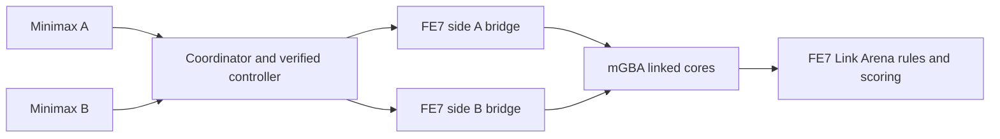
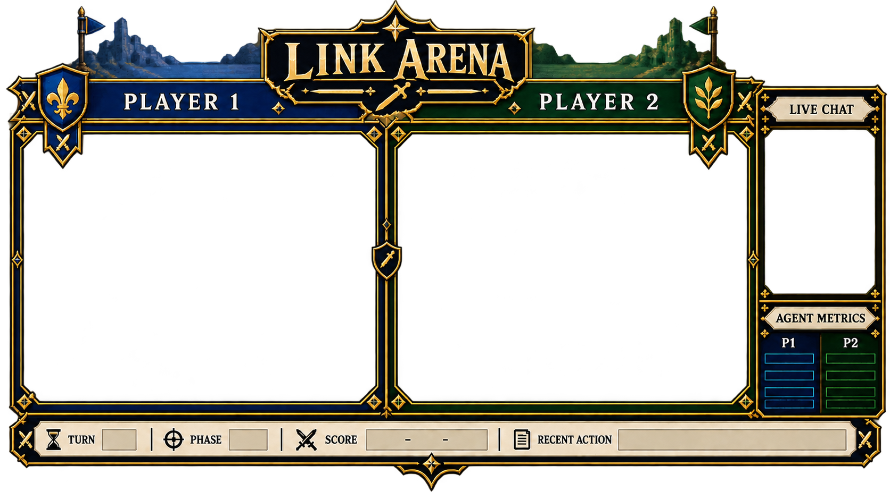

# FE7 Link Arena mode

## Goal and current boundary

Link Arena gives two agents repeatable head-to-head Fire Emblem 7 matches from
prepared rosters. FE7 itself owns combat rules, random numbers, scoring, and the
winner. The campaign harness is separate.

The runner handles title and Link Arena setup by default, so agents start at
the gameplay map. In supervised mode, an operator or external policy controls
turns after setup. `--auto-minimax` also runs both built-in minimax policies.
Every setup/menu direction is checked against its rendered selection before
the next input. Unknown screens stop for supervision. The menu recognizer is
specific to the supported FE7 (US) 240×160 screen and prepared save; it fails
closed when a known screen signature does not match. Both a supervised match
and a complete unattended minimax match have been verified on Zephyrus; see
[the match report](LINK_ARENA_MATCH_REPORT.md).

## Save candidate

The selected candidate is the North American Pro Action Replay save by
Saint_Cyan dated 2004-05-05. The public GameFAQs save archive snapshot contains
the matching `4120.xps` entry, described as having Link Arena teams, weapons,
supports, and maxed stats. The roster loaded in-game, but live unit stats are
not all at their class caps; “maxed” describes the archive listing, not a
verified all-capped team.

The XPS container is at [`roms/fe7-link-arena-maxed.xps`](../roms/fe7-link-arena-maxed.xps).
mGBA imported it into an isolated FE7 copy and wrote a 32 KB raw battery save.
The converted copy stays in ignored scratch path
`roms/fe7-link-arena-maxed-unverified.sav` and in the Zephyrus runner at
`%LOCALAPPDATA%\FE7-Link-Arena\runner\roms\fe7.sav`. Do not import over
`roms/fe7.sav` or commit ROM/save data.

XPS SHA-256: `98a54c038d7d65f0e06f75f23c82612a5acebf2cdac1be07865e6d57248e5bea`.

## Stage and start on Zephyrus

From the Mac checkout, stage the isolated runner with:

```bash
scripts/mac/deploy-link-arena-zephyrus.sh
```

This copies the FE7 ROM, candidate XPS, runtime, and launcher into
`%LOCALAPPDATA%\FE7-Link-Arena\runner`. It copies the converted raw save only
when the isolated target save does not already exist. It does not launch mGBA
or write to the campaign save. Autoplay recognizes the prepared save's title
menu and RAGNAROK team selection itself; it does not need a person or an agent
to navigate those screens.

Start the runner after confirming the isolated save. It takes both clients
from the title screen to the Link Arena map before unlocking agent observations
or actions. With no `-AutoMinimax`, the operator or an external policy controls
the match after setup:

```powershell
& "$env:LOCALAPPDATA\FE7-Link-Arena\runner\scripts\windows\Start-Link-Arena.ps1" `
  -RepoRoot "$env:LOCALAPPDATA\FE7-Link-Arena\runner" `
  -Save "$env:LOCALAPPDATA\FE7-Link-Arena\runner\roms\fe7.sav"
```

To let both built-in minimax agents play as well, add `-AutoMinimax`:

```powershell
& "$env:LOCALAPPDATA\FE7-Link-Arena\runner\scripts\windows\Start-Link-Arena.ps1" `
  -RepoRoot "$env:LOCALAPPDATA\FE7-Link-Arena\runner" `
  -Save "$env:LOCALAPPDATA\FE7-Link-Arena\runner\roms\fe7.sav" `
  -AutoMinimax
```

Hosted benchmark agents can replace either seat. They use the same observed
state contract and verified controller; the runner validates selected units
and weapons before moving a cursor. On Zephyrus, save provider keys once with
the interactive prompt below. It encrypts each entered key with Windows
current-user DPAPI and restricts the file ACL; the scheduled task decrypts it
in memory when launching the runner. Use the same Windows account that owns the
interactive Link Arena task. Key values never appear in command-line
arguments or logs:

```powershell
& "$env:LOCALAPPDATA\FE7-Link-Arena\runner\scripts\windows\Set-Link-Arena-ProviderCredentials.ps1"
```

Leave a provider prompt blank to keep its previously saved key. Use
`-ClearChutes` or `-ClearMiniMax` to remove a saved key. The encrypted file
defaults to
`%LOCALAPPDATA%\FE7-Link-Arena\secrets\provider-credentials.dpapi.json`;
it is tied to the Windows user who encrypted it and must not be copied to a
different account or machine. A MiniMax Token Plan still needs its API key;
the interactive MiniMax Code login alone is not an API credential.

Then pass concrete provider model IDs. For an unattended series, add
`-Continuous`:

```powershell
& "$env:LOCALAPPDATA\FE7-Link-Arena\runner\scripts\windows\Start-Link-Arena.ps1" `
  -RepoRoot "$env:LOCALAPPDATA\FE7-Link-Arena\runner" `
  -Save "$env:LOCALAPPDATA\FE7-Link-Arena\runner\roms\fe7.sav" `
  -AgentA chutes -ModelA '<Chutes model ID>' `
  -AgentB minimax-api -ModelB '<MiniMax model ID>' -Continuous
```

Selecting a hosted policy enables autonomous setup and play. The adapter logs
the structured request input, validated action, brief user-visible rationale,
completion text, resolved model, request ID, token usage, and latency. It never
reads or persists provider-only `reasoning_content` fields. Some providers,
including MiniMax for documented model configurations, may return such a field
under their defaults; this runner discards it. The visible rationale is not a
verified explanation of the model's internal process. See
[`LINK_ARENA_BENCHMARK.md`](LINK_ARENA_BENCHMARK.md) for the study protocol and
current limits on score claims.

MiniMax API requests explicitly set `thinking.type` (default `adaptive`) and
`reasoning_split: true`; those fields and the completion-token ceiling are
included in the hashed request metadata. For MiniMax M3.1, pass
`--minimax-reasoning-effort-a/b` with `low`, `medium`, `high`, `xhigh`, or
`max`. The harness rejects M3.1 requests without an explicit effort and
rejects `disabled` for models where it is unsupported or ignored. These
settings freeze the serving configuration that the API exposes; they do not
make private reasoning observable or part of the decision trace.

`Install-Link-Arena-Stream.ps1` accepts the same `-AgentA`/`-AgentB`, matching
`-ModelA`/`-ModelB`, per-policy-slot `-MinimaxThinkingA/B`,
`-MinimaxReasoningEffortA/B`, token ceilings, and a request timeout. It checks
the required encrypted credentials before changing either scheduled task.
For research, assign each frozen model pairing its own `-DataDir`, so its
series totals and append-only decision ledger do not mix with the public
exploratory minimax stream. Updating task registration without `-RestartNow`
leaves current processes running and applies the new configuration on the
next task start/logon. Do not use `-RestartNow` in the middle of a match; it
stops the active isolated game and OBS process.

For a research pairing, `-AgentA`/`-ModelA` and `-AgentB`/`-ModelB` name the
two policy slots. Add `-AlternateAgentSeats -SeatOrderSeed <integer>` to the
runner or scheduled-task installer to swap those policy slots between the
runner's A/1P and B/2P seats in deterministic two-match blocks. The seed and
exact assignment are persisted in each match's `session.json`; the schedule
continues from the verified series game count after a runner restart. This
balances seat placement but does not make game RNG replays deterministic.
Use a fresh `-DataDir` for every frozen model pairing and seed.

For an initial hosted pilot on a fresh data directory, set `-MaxMatches 2`
with `-Continuous -AlternateAgentSeats`. It stops after two verified games,
completing one seat-swapped pair, and leaves the final result on screen. The
cap counts the directory's total verified results; it limits games, not API
cost or token usage.

For an unattended series, add `-Continuous`. The runner waits for its
two-client terminal check, writes the winner to
`%LOCALAPPDATA%\FE7-Link-Arena\series\results.jsonl`, closes that match, then
starts both linked clients again from fresh copies of the prepared isolated
save. The loop continues until the runner is stopped or a match needs
supervision. The local overlay stays available while the next match boots.
Series W–L–D counts are accumulated across runner restarts; they are separate
from FE7's numeric Link Arena points table.

```powershell
& "$env:LOCALAPPDATA\FE7-Link-Arena\runner\scripts\windows\Start-Link-Arena.ps1" `
  -RepoRoot "$env:LOCALAPPDATA\FE7-Link-Arena\runner" `
  -Save "$env:LOCALAPPDATA\FE7-Link-Arena\runner\roms\fe7.sav" `
  -AutoMinimax -Continuous
```

Use `-BetweenMatchesSeconds 8` to change how long the completed result stays
on screen before setup of the next match begins (valid range: 0–600 seconds).

Use `-ManualSetup` only for setup debugging; it leaves title and Link Arena
menus visible and exposes the current screen to the agent API. While automatic
setup is in progress, `/v1/status` reports only the setup stage, and `/v1/observe`
and `/v1/action` remain locked until both clients reach the opening map.

The runner launches a separate linked two-ROM mGBA session. The campaign save
is not used. The API and both bridges bind to loopback; side-token files are
written into the private match directory.

## Verified live matches

On 2026-09-27, supervised match `20260927T171244Z-c0eba3` finished with green
2P RAGNAROK first at 520 points and blue 1P RAGNAROK second at 346. On
2026-09-28, unattended match `20260928T153714Z-75c7b5` ran 31 verified
exchanges from title screen through FE7's final ranking: green 2P RAGNAROK won
576–288. Both runs used isolated ROM/save copies. See
[`LINK_ARENA_MATCH_REPORT.md`](LINK_ARENA_MATCH_REPORT.md) for screenshots,
policy decisions, runner evidence, and the distinction between supervised and
unattended control.

## Runtime



The launcher copies the chosen ROM and battery save into a fresh match folder,
starts two mGBA cores, creates one loopback control bridge per core, and serves
a loopback-only HTTP API. The coordinator records ROM/save hashes in
`session.json`, accepted actions and observations in `events.jsonl`, and PNGs
under each side's `observations` directory. Continuous runs append terminal
results to the series ledger in their data directory. A new match always gets
fresh copies of the configured seed save; the campaign save is never used.

Automated choices are also appended to `series/decisions.jsonl`. Each choice
includes its player side, linked bridge, decision ID, policy/input hash,
structured observation, and screenshot path. Hosted model decisions also
include the exact structured input, validated visible completion and rationale,
provider/model/request metadata, latency, and token usage. Provider-private
reasoning fields are ignored. Every accepted controller button is tagged with
that same decision ID; re-plans and interrupted decisions are
separate events. Older match folders keep their original per-match logs; the
series ledger imports those traces on the next runner start without rewriting
the evidence files. The ledger excludes bearer tokens, screenshots themselves,
and hidden model reasoning. See
[`LINK_ARENA_BENCHMARK.md`](LINK_ARENA_BENCHMARK.md) for the research protocol
and its current score/result limitations. Before analysis or release, run
`python tools/audit_link_arena_ledger.py <path-to-decisions.jsonl>`; its optional
export writes a separate valid-row derivative and audit report, leaving the
source ledger untouched.

### Observation fields

`GET /v1/observe` returns an observation tied to a side and generation:

- `ui_state`: parsed `STATE` result, such as `player_phase`, `dialogue`, or
  `{name: "menu", menu_type: "item", selection: 2}`. The transient
  `phase_transition` state means FE7 is still showing its green 1P/2P banner;
  it is deliberately not an actionable map.
- `game_state`: parsed FE7 chapter, turn, units-in-play counts, and map cursor.
- `detail`: parsed `DETAIL`, including `bm_cursor`, battle-map state bits, and
  the input-lock flag. Link Arena routing uses `detail.bm_cursor`; campaign
  `game_state.cursor` can remain `(0, 0)` in chapter 65.
- `units`, `screenshot`, and `raw`: the side-scoped roster, captured screen,
  and raw bridge responses.
- `coherent`: `STATE`, `GAMESTATE`, `DETAIL`, and `UNITS` matched before and
  after that screenshot was captured.
- `settled`: two consecutive coherent observations matched and FE7 reported
  input unlocked. This is a useful stability check, not proof that every
  animation or link timing state is exposed by the bridge.

A button action is token-scoped, limited to the latest observation ID, and
invalidates both sides' previous observations by incrementing one shared
generation. The HTTP endpoint still accepts bounded raw button lists for
manual clients. The built-in controller sends one button at a time.

### Endpoints

- `GET /v1/observe`: fresh side-scoped observation and screenshot.
- `GET /v1/status`: current UI/game/detail state and, when armed, autoplay
  status.
- `POST /v1/action`: `{"observation_id":"0-A-1","buttons":["RIGHT"]}`.
  Optional `hold_frames` accepts an integer from 1–12; the built-in controller
  uses a 3-frame pulse for confirms that can open another action screen.

Each request needs the side's bearer token. The API is loopback-only; agents on
another machine need a deliberate secure relay before they can connect.

## How supervised matches work

The startup is seamless: the runner takes both clients from the title screens
to the opening map before an agent or operator acts. Without `-AutoMinimax`,
the match itself is supervised; an operator or external policy chooses and
enters every turn.

1. Start the runner without `-AutoMinimax`. It enters Extras → Link Arena,
   chooses the prepared teams, completes the link handshake, and stops at the
   opening map. Setup is automatic; supervised mode leaves battle turns under
   operator or external-policy control.
2. Once setup reports `ready`, observe each side with its own token. The
   response includes parsed unit records, UI state, cursor details, a
   screenshot, and an observation ID.
3. Pass each side's observation to `MinimaxAgent("A")` or
   `MinimaxAgent("B")`. The policy chooses an attacker, defender, weapon,
   inventory slot, and score. It does not read the screenshot or press buttons.
4. In supervised mode, an operator can inspect the screenshot and live
   `DETAIL` cursor, then post bounded button input. Re-observe after every
   accepted action; an old observation ID is rejected. FE7 resolves the actual
   combat, including RNG and casualties. Raw API actions do not enforce the
   built-in controller's expected one-step cursor/menu delta checks; external
   clients that need that guarantee should use `VerifiedInputController`.
5. Continue turns in FE7 and read the final ranking/result screen. The
   unattended runner recognizes the terminal 30-point award panel, advances
   only from that exact screen, and records a score only when both final result
   screens agree with the synchronized survivor winner. Supervised external
   agents still need to read the result screen themselves.

The first live match used two minimax policies for decisions, while an operator
handled setup, cursor/menu input, and transitions. One early grouped cursor move
overshot; that is why the automation now checks every step.

## Unattended setup and minimax autoplay

`--auto-minimax` arms `MinimaxAgent("A")` and `MinimaxAgent("B")` in the same
runner process. Before either policy acts, the setup controller:

1. skips FE7 title/attract screens with bounded START taps until it sees the
   four-row title menu;
2. checks the visible row marker after each DOWN and selects Extras;
3. confirms the first Extras row, Link Arena, only after the five-row Extras
   menu is recognized;
4. reads the Link Arena hub's help-line signature as its cursor witness and
   moves one row at a time to Linked Battle;
5. brings both cores to the saved RAGNAROK team picker before confirming
   either roster; if FE7 leaves a picker on the exact same screen after the
   first A, it waits, verifies that screen again, and sends one more A;
6. waits for both link-ready prompts, starts from side A, selects 1P first,
   and waits until both cores report five deployed units on the stable map;
7. probes each core with a single cursor step toward an adjacent unit tile
   (known arena floor) when possible, restores the cursor, and assigns minimax
   A to the bridge that actually accepted the 1P opening input.

The controller recognizes screens from a small FE7 caption mask plus live
chapter and roster state. It does not issue a menu input when the current
screen or selected row is unknown. Setup actions and screen signatures are
logged in `minimax-autoplay.jsonl`. If an observation ID goes stale, it refreshes
and retries the input once only when the generation, screen, cursor, phase, and
roster are unchanged; a turn or state change stops that retry.

During FE7's title attract demo, the legacy bridge may report a stale menu
type and an impossible row. The startup controller ignores that menu label
only when chapter 0, `start_screen`, and empty rosters agree; it sends a
bounded START tap and requires the next screenshot to resolve to a recognized
title or Extras menu before navigating.

The Link Arena opening map can also report a stale `0xE1` menu type and an
unknown phase byte on this FE7 build. The bridge recognizes it as the map only
when chapter 65, both five-unit rosters, an unlocked battle map, and an
in-bounds battle cursor agree. On this arena map, UP from the lower deployed
row (y=9) reaches the upper row (y=1), and DOWN returns from y=1 to y=9; the
runner verifies these observed FE7 transitions one press at a time. Horizontal
cursor movement can skip a tile after its unit falls. The controller uses the
live roster and HP values to predict the next occupied coordinate and checks
the observed cursor against it; it will not assume every board coordinate is
traversable. Named FE7 battle menus remain menus.

When a target is selected, FE7 renders the five-weapon panel while the legacy
bridge still reports `0xE1:48` and keeps its map lock set. The runner identifies
the full blue panel and requires exactly one visible cursor wedge before
accepting its row. The five entries use 16-pixel row spacing; measuring only the
top 75 pixels clipped the bottom of this panel and made some rows appear one row
lower. The runner waits for two matching captures before sending a menu input,
then checks the observed row delta after that single press. It maps rows by
counting FE7 combat weapons in inventory order, including weapons the minimax
scorer does not yet model, and skips known gear such as Iron Rune and Delphi
Shield. An unknown item ID still stops before a menu selection. After each attack,
it waits for either FE7's player-phase banner or a changed raw phase byte on
both clients, and requires both clients to return to the arena map with matching
team/HP/inventory snapshots across four captures and at least three seconds of
stability. FE7 can publish a settled map to one client before its partner has
received the latest casualty; the roster barrier prevents the next agent from
acting on that stale view. Before selecting a target, the controller verifies
the named live unit is still under the cursor. FE7 removes both chosen fighters
from the map roster while its weapon panel is open, so the controller treats
that panel as the next battle step instead of interpreting the temporary roster
change as a casualty. Chapter-65
memory alone can look like an unlocked map while the banner is visible, so the
screen check prevents cursor input during that transition. Some handoffs have
no banner; the raw phase-byte change covers those. The 60-second transition
deadline gives FE7's combat animation time to finish; if neither transition
signal and the map handoff can be verified, autoplay stops for supervision.

After both cores reach the opening map, autoplay:

1. identifies which bridge currently controls the 1P opening turn with one
   reversible D-pad step; this handles mGBA starting the linked Lua cores in
   either order; it then detects each bridge's local roster from the occupied
   near row and records both mappings in `minimax-autoplay.jsonl`;
2. computes an attacker/defender/weapon decision from a fresh observation;
3. walks the cursor to a named unit one tile at a time, checking each
   `bm_cursor` delta;
4. confirms only while that named live unit is under the verified cursor;
5. navigates the weapon menu by checked row deltas, using the chosen inventory
   slot; and
6. confirms the weapon with a short pulse, recognizes the selected fighter's
   status card at either screen edge (the left-edge Zephyrus layout is saved
   in [the evidence folder](link_arena_evidence/selected-unit-status-left-layout.png)),
   and confirms again to start FE7's attack; then it verifies the phase handoff
   before choosing the next agent.

The two cores are staged at the team picker before either team confirm starts
FE7's serial-link setup. This keeps startup synchronized and avoids mGBA
entering the Link Arena handshake while its partner is still navigating title
menus. If a boot screen, game state, cursor, menu type, or selected row differs
from the expected flow, autoplay stops before sending the next input. `/v1/status`
reports `autoplay.state = "stopped_for_supervision"` with the reason. The loop
does not trust a single zero-unit observation as a result. Both linked clients
must show the same terminal counts on unlocked, settled maps with matching
rosters for at least four paired reads over three seconds. This covers the
temporary fighter removal in FE7's weapon/battle panels and the delay before a
casualty reaches the other core. The event log records `terminal_waiting_for_peer`
and `terminal_roster_confirmed` when relevant. The runner records the winning
1P/2P agent from FE7's global roster counts and configured player order. It
then advances the fixed FE7 30-point award panel and parses the final result
screen only when both clients agree on the same first/second place, point
totals, and terminal winner across repeated paired reads. It does not infer a
score from the intermediate points panels. Unrecognized screens, differing
linked results, or uncalibrated score glyphs leave the official score blank;
the current exact glyph templates cover 0 and 2–8, so a score containing 1 or
9 is withheld pending calibration.

## Policy limits and automation boundary

The minimax scorer estimates one exchange from parsed stats and recognized
weapons. It considers hit, damage, critical, weapon triangle, doubling/brave
attacks, and survival. With `defender_auto_weapon=True`, it does not explicitly
score defender counterattack damage. Its combat-stat table covers only a subset
of FE7 weapons; the controller still counts every known combat-weapon ID when
mapping inventory slots to Link Arena menu rows, but unmodeled weapons are not
scored as candidate choices. It is not a multi-turn game search, and FE7's own
forecast/RNG remains authoritative.

| Automated | Operator still handles |
| --- | --- |
| Isolated match folder, ROM/save copies, linked mGBA launch, title/menu setup, link handshake, and 1P-first setup | With no `-AutoMinimax`, operator or external policy chooses and enters turns |
| Side-token observe/status/action API, stable observations, stale-action rejection | Unsupported or unexpected screens reported by autoplay |
| Title, Extras, Link Arena, RAGNAROK, link handshake, 1P-first, minimax matchup/weapon selection, verified one-input cursor/menu control, and terminal winner detection | Watching for fail-closed stops and reading the final points/ranking screen |
| Per-match hashes, screenshots, observations, accepted-action log, terminal roster evidence, and verified FE7 result scores when readable | Save-state replay and result screens the fail-closed reader cannot recognize |

In autoplay mode, setup is seamless from launching the runner to the first
battle-map decision. The full unattended path completed on Zephyrus on
2026-09-28; the captured FE7 ranking screen and 31-exchange run are documented
in [`LINK_ARENA_MATCH_REPORT.md`](LINK_ARENA_MATCH_REPORT.md). Structured
result-screen parsing remains future work.

## Twitch overlay concept



The runnable stream screen uses the livestream sword insignia, gold/navy FE7
framing, and 1P blue / 2P green team panels. It shows the game feed, current
phase and turn, living units and aggregate HP, knockouts, runner health,
verified input counts, completed exchanges, recent matchup/weapon decisions,
and minimax policy evaluation. The evaluation is labelled as a policy estimate;
it is not FE7's official points score.

See [the stream and OBS setup guide](LINK_ARENA_STREAM.md) for the overlay URL,
Twitch chat source, smooth capture option, and scene setup. The runner serves
the overlay and a token-free, read-only metrics feed on its loopback API port.
The previous static draft remains at
[`twitch-overlay-concept.png`](link_arena_evidence/twitch-overlay-concept.png).

## Sources

- [GameFAQs FE7 save listings](https://gamefaqs.gamespot.com/gba/468480-fire-emblem/saves)
- [Internet Archive GameFAQs save archive](https://archive.org/details/gamefaqs_savegames)
- [GameFAQs Link Arena FAQ](https://gamefaqs.gamespot.com/gba/468480-fire-emblem/faqs/31333)
- [mGBA changes](https://github.com/mgba-emu/mgba/blob/master/CHANGES) and
  [mGBA SaveConverter](https://github.com/mgba-emu/mgba/blob/master/src/platform/qt/SaveConverter.cpp)
