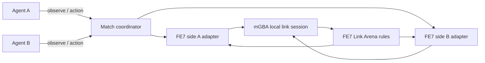
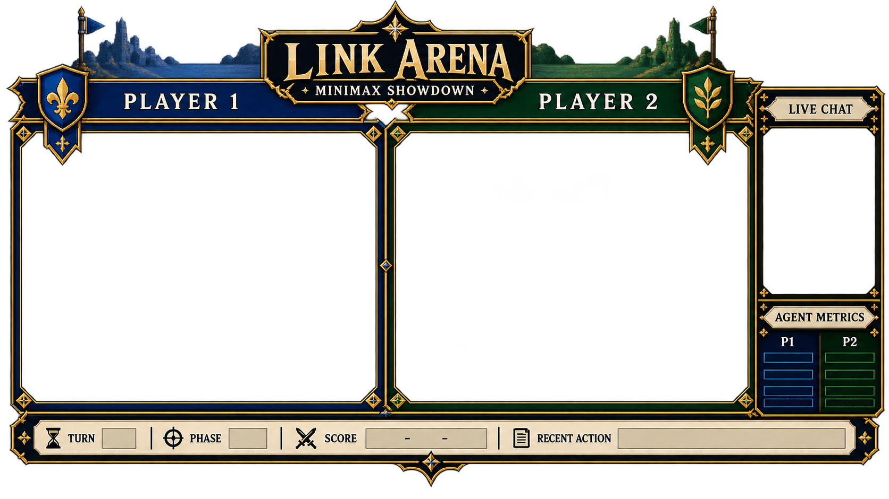

# FE7 Link Arena mode

## Goal

Give two agents a repeatable, head-to-head Fire Emblem 7 Link Arena match. A
match starts from a prepared roster, uses the game’s own link battle rules, and
does not require either agent to play the campaign. The first playable version
is **supervised**, not seamless autoplay: minimax policies recommend matchups
and weapons, while an operator handles setup, confirms controls, and checks the
live emulator screens.

The existing campaign loop stays separate. It assumes chapters, objectives,
player/enemy phases, and tutorial state; Link Arena needs its own setup flow,
observation contract, and match lifecycle.

## Save candidate

The selected candidate is the North American Pro Action Replay save by
Saint_Cyan dated 2004-05-05. GameFAQs describes it as having maxed stats,
Link Arena teams, weapons, and supports. The public GameFAQs save archive
snapshot contains the matching entry as `4120.xps`.

The candidate is downloaded locally as
[`roms/fe7-link-arena-maxed.xps`](../roms/fe7-link-arena-maxed.xps). It is a
64 KB-class X-Port snapshot/container, not a raw mGBA `.sav`. mGBA imported it
into an isolated FE7 copy and wrote a 32 KB `FE7.sav`. On Zephyrus, that save
booted, opened Extras and Link Arena, and loaded the `RAGNAROK` teams on both
clients. The roster is highly trained, but the live unit stats are not all at
their class caps, so “maxed” here describes the save listing rather than a
verified all-stats-capped roster. The converted file stays in the ignored
scratch path `roms/fe7-link-arena-maxed-unverified.sav` and the isolated runner
copy `%LOCALAPPDATA%\FE7-Link-Arena\runner\roms\fe7.sav`. Do not import over
`roms/fe7.sav` or commit ROM/save data.

The downloaded XPS has SHA-256
`98a54c038d7d65f0e06f75f23c82612a5acebf2cdac1be07865e6d57248e5bea`.

## Zephyrus workspace

The Windows launcher uses mGBA's installed path and stores match data under
`%LOCALAPPDATA%\FE7-Link-Arena`. To stage an isolated working copy on
Zephyrus from the Mac checkout, run:

```bash
scripts/mac/deploy-link-arena-zephyrus.sh
```

That copies the FE7 ROM into
`%LOCALAPPDATA%\FE7-Link-Arena\runner\roms` and stages the candidate XPS and
Link Arena runtime there. It stages the unverified 32 KB raw conversion as
`runner\roms\fe7.sav` only if the target does not already exist. It does not
open mGBA or touch the campaign save. Open
only the isolated `runner\roms\fe7.gba` in mGBA and confirm Continue/Extras
and the Link Arena roster in-game. If the raw save does not load, use mGBA's
**File → Save games → Convert save game…** with the staged XPS, writing to a
separate file before replacing the isolated `fe7.sav`. Start the runner after
the in-game check:

```powershell
& "$env:LOCALAPPDATA\FE7-Link-Arena\runner\scripts\windows\Start-Link-Arena.ps1" `
  -RepoRoot "$env:LOCALAPPDATA\FE7-Link-Arena\runner" `
  -Save "$env:LOCALAPPDATA\FE7-Link-Arena\runner\roms\fe7.sav"
```

This starts a separate two-ROM mGBA process. The existing `roms\fe7.sav` in
the campaign checkout is not used. The API and both control bridges bind to
loopback, and Windows inherits the current user's local-app-data ACLs for the
side-token files.

## Verified status

- The 2004 GameFAQs XPS save was imported into an isolated 32 KB battery save;
  both Zephyrus clients loaded the RAGNAROK Link Arena roster.
- Two mGBA cores connected through the Link Arena. Side A used port 18888,
  side B used 18889, and the token-scoped API served each client.
- `MinimaxAgent("A")` and `MinimaxAgent("B")` independently selected legal
  matchups and weapons from their side-scoped observations during a complete
  game. The game, rather than the policy model, resolved hit RNG, casualties,
  score, and the winner.
- The verified match ended on FE7's result screens: green 2P RAGNAROK placed
  1st with 520 points; blue 1P RAGNAROK placed 2nd with 346 points. Screenshots
  and the match ID are recorded in
  [`LINK_ARENA_MATCH_REPORT.md`](LINK_ARENA_MATCH_REPORT.md).
- Preserve the campaign save: the match used the isolated runner save and did
  not write to `roms/fe7.sav`.

The newer North American 32 KB GameShark save by Memory- (2026-05-19) is still
a possible alternate roster. It is described as 100% complete with three
optimized teams, not as an all-stats-capped roster.

## Runtime shape



- Start two copies of the same North American FE7 ROM in mGBA’s local
  multiplayer session. Each side gets a separate copy of the seed save and a
  side-specific control bridge.
- An operator takes both clients through Link Arena setup and the link
  handshake. Once battle begins, FE7 owns turn order, battle rules, RNG, and
  victory adjudication.
- Each policy receives only its side’s observation. The coordinator routes
  bounded button actions to that side and rejects stale observations. The
  operator still checks screen state and cursor position; reliable
  screen-settling detection is not implemented.
- `session.json` records the ROM and seed-save hashes and bridge/API settings.
  `events.jsonl` records observations and accepted actions, with screenshots
  saved beside it. The runner does not checkpoint emulator/PRNG memory, parse
  the final ranking into a result, or replay a match deterministically.

mGBA’s Qt frontend supports multiple game windows and local link cable play;
the installed app on Zephyrus is an mGBA 0.11 development build. Its Lua
startup script is attached to each loaded core. Windows allowed both scripts
to bind the same loopback port, so selecting a port by retrying on a bind error
did not distinguish the cores. The runner now claims one of two per-match
marker directories atomically before binding each core to its assigned port.
On 2026-09-27, this setup reached linked FE7 Link Arena combat and completed
the match recorded below. Cursor movement must be checked against the live
`DETAIL` cursor: batching repeated directional keys can overshoot a unit on
some FE7 screens.

## First implementation slice

The isolated runtime is in `src/link_arena/` with a launcher in
`tools/link_arena.py`. It copies the selected ROM and battery save into two
match-local directories, launches mGBA once with both ROMs and a generated
bridge script, then serves a loopback-only HTTP API. Each side gets its own
token file. Observations contain that side’s screenshot, parsed FE7 state and
units, and raw state strings. The coordinator writes each PNG under that
match's `side-a/observations` or `side-b/observations` directory and logs the
full observation state plus its image path to `events.jsonl`. The seed save
and ROM hashes are recorded in `session.json`. The API still does not parse the
Link Arena result screen into a terminal outcome; the verified winner was read
from FE7's result/ranking screens. The `settled` field is intentionally
null today; `coherent` only means the exposed game-state string matched before
and after capture. It is not proof that an animation, menu transition, or link
handoff has finished.

Actions are side-token scoped, capped at eight button presses, serialized by
the coordinator, and tied to an observation ID. Every accepted action
increments one shared generation and invalidates observations for both sides;
a changed game state also requires a fresh observation. The current action
contract is raw bounded button input, not typed menu or tactical commands.

Once a converted `.sav` has been confirmed in-game, start a match with:

```bash
python3 tools/link_arena.py --rom roms/fe7.gba --save /path/to/isolated/fe7.sav
```

The `--save` path must point to a converted raw battery save that was verified
in the isolated FE7 copy. The CLI default is `roms/fe7-link-arena-maxed.sav`,
which is not included in the repository; the downloaded `.xps` is not a valid
`--save` input. Pass the path to your verified conversion explicitly. On
Zephyrus, use the PowerShell launcher above, which passes the isolated
`runner\roms\fe7.sav` explicitly.

The launcher prints the local API address and paths to the side token files.
The agent API is loopback-only, so remote agents on another machine cannot
connect to it as shipped. No ready-made HTTP agent client is included. A
same-host client uses `GET /v1/observe` and `GET /v1/status` with its own bearer
token; `POST /v1/action` accepts JSON of the form
`{"observation_id":"...","buttons":["RIGHT","A"]}`. It binds only to
`127.0.0.1`, as are the per-side control bridges; the coordinator writes
actions and observations to the match directory’s `events.jsonl` and saves
screenshots alongside them.

For example, use the side A token printed by the runner to observe and act:

```bash
TOKEN="$(cat /path/to/match/side-a.token)"
curl -H "Authorization: Bearer $TOKEN" http://127.0.0.1:18700/v1/observe
curl -X POST -H "Authorization: Bearer $TOKEN" -H "Content-Type: application/json" \
  -d '{"observation_id":"0-A-1","buttons":["RIGHT","A"]}' \
  http://127.0.0.1:18700/v1/action
```

## How a supervised match runs

1. **Prepare and link the clients.** Stage the isolated ROM and save, start the
   runner, then use the two mGBA windows to enter Link Arena and complete the
   connection/team setup. The launcher starts the linked emulator and API; it
   does not navigate these menus.
2. **Observe one side.** A client requests `/v1/observe` using that side's
   bearer token. The response includes parsed game-state fields, unit records,
   the screenshot, raw bridge responses, and an observation ID.
3. **Ask the policy for a decision.** `MinimaxAgent("A")` or
   `MinimaxAgent("B")` consumes that side's observation and returns an
   attacker, defender, weapon, inventory slot, and score. It is a Python
   policy class, not a running service. A caller must pass observations to it;
   this repository has no HTTP client or loop that polls both sides, calls the
   policies, and plays a whole game unattended.

   ```python
   from src.link_arena.agents import MinimaxAgent

   agent = MinimaxAgent("A", defender_auto_weapon=True)
   decision = agent.choose_matchup(observation)
   ```

   The policy reads parsed unit records; it does not interpret the screenshot.
   The operator uses the screenshot and mGBA `DETAIL` view to verify the actual
   cursor and menu state.
4. **Execute with supervision.** The operator/client translates the choice to
   cursor and menu button presses and posts them to `/v1/action`. Each action
   contains at most eight presses. Re-observe after every accepted action;
   never reuse the old observation ID. Check the visible `DETAIL` cursor and
   menu before confirming. The path helper is geometric and does not verify
   that the game cursor arrived at the intended unit. The chosen inventory
   slot also needs to be matched to the actual weapon-menu row.
5. **Repeat and finish manually.** The operator advances the alternating
   battle flow, handles transitions and confirmations, and recognizes the
   result/ranking screens. Ctrl-C stops the API and mGBA process; observations,
   action records, and screenshots remain in that match's data directory.

The minimax code is a decision aid, not a full arena simulator. It scores
recognized weapons using estimated hit, damage, critical, weapon triangle,
doubling/brave attacks, and survival bonuses. Depending on the
`defender_auto_weapon` option, it either omits a defender-selected counterweapon
from its score or evaluates the defender's recognized counterweapons and uses
the worst reply. The verified match used `defender_auto_weapon=True`, so the
policy did not explicitly score counterattack damage even though FE7 still
resolved the real battle. This is a one-exchange estimate, not multi-turn game
search. FE7 resolves the actual forecast, RNG, damage, and winner, so a policy
choice does not guarantee that a unit survives or wins.

## Automation boundary

| Automated today | Operator still handles |
| --- | --- |
| Creates an isolated match folder and copies the ROM and seed save for each side | Starting both Link Arena clients and completing the link/team setup |
| Launches one linked two-ROM mGBA session and assigns two loopback bridges | Reading the live cursor, menu row, and transition state before confirming |
| Serves side-token authenticated observe/status/action endpoints | Applying policy choices as safe button presses and alternating turns |
| Captures screenshots and parsed/raw state; rejects stale actions | Detecting combat end and reading FE7's result/ranking screen |
| Provides minimax matchup and weapon decision functions | Resetting/replaying a saved state and recording a structured winner |

So the answer to “are matches seamless?” is **no, not yet**. A complete game
has been played with two minimax policies, but it was supervised. The API has
no working `settled` signal or terminal-result parser, and the repo has no
autonomous setup/turn/result loop. One early grouped cursor move overshot its
target; the operator checked later cursor positions in the live `DETAIL` view.

## Current observation and action contract

An observation currently contains the side, generation, parsed game-state
fields and units exposed by the Lua bridge, a screenshot, raw game-state/unit
strings, and a `coherent` flag. `settled` is `null`; menu semantics and terminal
match state are not decoded into reliable typed fields.

The policy chooses units and weapons from the parsed roster. It does not get an
engine-verified legal-action catalog, write emulator memory, or send button
presses itself. The API accepts only that side's bearer token and a bounded list
of button names tied to the latest observation ID.

## Delivery plan

1. **Save and boot proof — complete.** The isolated XPS conversion opened the
   RAGNAROK roster in Link Arena.
2. **Cable and bridge proof — complete.** Two cores reached battle through
   side-specific loopback bridges and the local API.
3. **Playable minimax match — complete.** Two independent minimax policies
   chose matchups and weapons through the API; FE7 produced a 2P win.
4. **Next improvements.** Add verified cursor/menu decoding, a two-policy
   driver that re-observes and confirms transitions, automatic turn and result
   handling, and reset/replay from an emulator checkpoint. These are
   prerequisites for unattended matches, not part of the current milestone.
   The early batched cursor path caused one off-policy A Oswin/B Bartre matchup
   before live cursor verification was added to the operator loop.

## First playable milestone

The first playable milestone is verified. This is a real FE7 Link Arena match,
not a campaign simulation or a scripted combat replay. The agent policies
produced matchup and weapon decisions; bounded controller inputs advanced
FE7's menus and its own battle/result logic. Fully automatic turn and result
screen orchestration remains future work.

## Twitch overlay concept



This is a visual concept for a future Twitch scene: two transparent game
capture windows, blue/green player frames, a chat and agent-metrics rail, and a
match-information footer. It is concept art only; there is no OBS scene,
browser source, live score/turn feed, or overlay integration in the harness.

## Sources

- [GameFAQs FE7 save listings](https://gamefaqs.gamespot.com/gba/468480-fire-emblem/saves)
- [Internet Archive GameFAQs save archive snapshot](https://archive.org/details/gamefaqs_savegames)
- [GameFAQs Link Arena FAQ](https://gamefaqs.gamespot.com/gba/468480-fire-emblem/faqs/31333)
- [mGBA changes](https://github.com/mgba-emu/mgba/blob/master/CHANGES) and
  [mGBA SaveConverter](https://github.com/mgba-emu/mgba/blob/master/src/platform/qt/SaveConverter.cpp) and
  [Qt multiplayer initialization](https://github.com/mgba-emu/mgba/blob/master/src/platform/qt/GBAApp.cpp) and
  [per-window startup scripting](https://github.com/mgba-emu/mgba/blob/master/src/platform/qt/Window.cpp#L2184-L2193)
