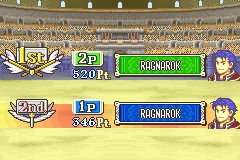
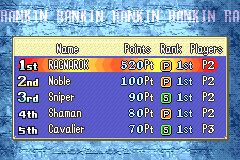
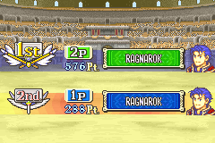
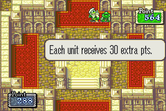
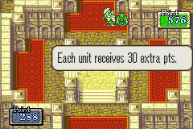
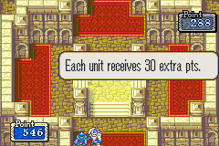
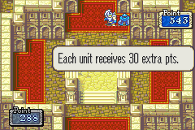

# FE7 Link Arena minimax match

## Result

The first complete match through the Zephyrus harness finished on 2026-09-27.
FE7's own result screen declared green side 2P the winner:

| Place | Side | Team label | Points |
| --- | --- | --- | ---: |
| 1st | 2P, green | RAGNAROK | 520 |
| 2nd | 1P, blue | RAGNAROK | 346 |

The last live board had one survivor per side at 31 HP. The final result screen
and the ranking screen are saved from the Zephyrus API captures:

## Unattended runner validation

On 2026-09-28, match `20260928T153714Z-75c7b5` completed on Zephyrus with
`--auto-minimax`. The runner navigated both clients from the title screen,
confirmed the saved RAGNAROK teams, completed the link handshake, mapped the
1P-first core, and played 31 exchanges with two built-in minimax agents. No
operator supplied gameplay inputs.

FE7's own final ranking screen declared green 2P RAGNAROK the winner:

| Place | Side | Team label | Points |
| --- | --- | --- | ---: |
| 1st | 2P, green | RAGNAROK | 576 |
| 2nd | 1P, blue | RAGNAROK | 288 |

The startup and every exchange used the verified one-input controller: it
checked cursor coordinates and menu rows after each button, confirmed the
weapon/status-card gates, and waited for synchronized rosters before either
agent acted again. At the end, both cores confirmed the same terminal roster
across four paired reads spanning 4.7 seconds. During the run, one core briefly
reported zero players while its peer still showed one; the runner logged
`terminal_waiting_for_peer` and continued until the linked views agreed. This
is why the terminal check requires both settled maps instead of trusting a
single transient count.

The run used the separate Zephyrus ROM/save copies. Its match logs and PNG
observations remain under
`%LOCALAPPDATA%\FE7-Link-Arena\20260928T153714Z-75c7b5`. It used bridge ports
18942/18943 and API port 18716. At the time of this match, point/rank
extraction into a structured API record remained manual; the later score-reader
deployment and its validation are tracked below.

## Exploratory continuous-series checkpoint

Later on 2026-09-28, the continuous unattended runner completed eight
consecutive local-minimax games. The first six were recorded as 2P wins and
the next two as 1P wins from the synchronized survivor state. They used the
same prepared team/save and fixed seats, so this is operational evidence only,
not a seat-balanced benchmark result. At 19:55 UTC, match
`20260928T195429Z-ed9dda` had automatically entered game-nine setup at
`open_linked_battle`. The live series record showed 8 completed games, 1P 2
wins, and 2P 6. The lock-consistent decision-ledger audit and its preserved
malformed historical line are documented in the benchmark protocol.

At the game-four handoff, the read-only 1P view captured this in-game points
panel and bonus transition:

The panels display 564 and 288 while FE7 says each unit receives 30 extra
points. This was captured before the final ranking screen, and no verified final
point total or official rank is inferred from it. The 2P survivor win in the
series ledger remains distinct from FE7's final numeric score.

The sixth match produced a second single-core transition capture. The 1P view
showed 576 and 288 while the same bonus message was displayed; the other core
had already moved to a different screen by its sequential capture. This is
therefore not a synchronized pair or a final-rank capture, and the displayed
values are retained only as intermediate game evidence:

At the end of game seven, both linked views captured the same 30-point bonus
transition, but the intermediate panels showed different totals (1P capture
546/288, 2P capture 543/288). These are paired transition evidence, not the
final ranking screen; no official points or rank are inferred from either
panel. The score feature was then made fail-closed so such disagreement could
not be written as a result.

## Score-reader rollout and shifted-view calibration

The continuous series completed game nine (`20260928T195429Z-ed9dda`, 1P
survivor win) and game ten (`20260928T201141Z-2a1583`, 2P survivor win). The
series ledger now has ten results: 1P 3 wins, 2P 7 wins, no draws. Game ten
used 16/15 exchanges. It ended on the then-deployed score-reader build, which
recognized only the standard client result layout; the official score was left
null and the live official-points counter remained 0 rather than accepting an
unverified one-sided result.

The retained terminal screenshots from game ten show the same final result in
two client layouts. The B/2P screenshot (`217-B-1153.png`, SHA-256
`6f2dd575e9b217c7aaf2762e0db03ed88dee931e4b5c94dfa34f547c7dcba20f`) parses
as 2P 576, 1P 288 in the standard layout. The A/1P screenshot
(`217-A-1188.png`, SHA-256
`8746548e4357c4b836866edcbfb14c748714b901fb51806bdef317e2c884b6a9`) contains
the same exact digit masks but moves the first row to the upper-left and clips
the lower row at the bottom. The working-tree reader recognizes both layouts;
both captures independently parse as 2P 576, 1P 288. The screenshots remain in
the match-local Zephyrus capture directory rather than being added as new
redistributed game-art assets.

The shifted-view change has passed bytecode compilation and manual fixture
checks against the 520–346 and 576–288 final-rank captures, the newly retained
game-ten captures, and the archived bonus transitions. The transition screens
still do not parse as final results. This code has not yet been deployed, so it
has not produced an official-points ledger entry. At 20:40 UTC, game eleven
(`20260928T202914Z-979bda`) was running unattended at turn 9 with 1P/2P
exchange counts 9/8. Its in-progress state is not included in the ten
completed-game record.

## First supervised match reproduction details

- Match ID: `20260927T171244Z-c0eba3`
- Host: Zephyrus, Windows, mGBA 0.11 development portable build
- Save: GameFAQs Action Replay XPS `4120.xps`, imported by mGBA into an
  isolated 32 KB battery save
- Game mode: Linked Battle, Link Arena chapter 65, RAGNAROK teams
- Side A / 1P: bridge port 18888, blue team
- Side B / 2P: bridge port 18889, green team
- Local agent API: `127.0.0.1:18700`; each side acted with its own bearer token
- ROM and save were copied to match-local runner folders. The campaign save
  `roms/fe7.sav` was not opened or modified by this run.

Both sides used `MinimaxAgent(side, defender_auto_weapon=True)` against the
current side-scoped unit observations. Decisions selected both a matchup and a
weapon. With this option, the policy score did not explicitly include a
defender-selected counterweapon; FE7 still resolved the real combat, hit RNG,
survival, points, and final rank. Representative decisions that reached
in-game forecasts included B Hector with Wolf Beil into A Oswin, A Canas with
Luna into B Hector, B Bartre with Basilikos into A Hector, A Canas with Luna
into B Oswin, and B Dorcas with Brave Bow into A Canas.

The harness actions and observations used the per-side HTTP API and token
files. The operator handled the setup menus, weapon-row confirms, and turn
handoff while consulting the live `DETAIL` cursor. One early grouped movement
overshot and caused A's 1 HP Oswin to attack B's Bartre instead of the planned
Hector/Oswin matchup; that exchange is part of this completed game. Afterward,
cursor movements were checked live and the later matchups followed the
minimax-selected units and weapons. This is a verified agent-driven match, but
not yet an unattended autoplay run.

The result screen is not currently parsed into a terminal outcome by the API.
The match was considered complete only after FE7 displayed the 2P 1st-place
screen and the ranking table showing 520 points versus 346.
